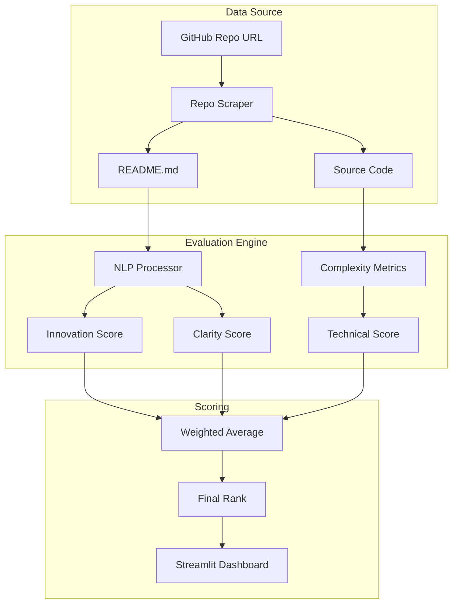

# ⚖️ AI Judge for Hackathons


> **Automated evaluation system for hackathon submissions using NLP to score innovation, technical complexity, and presentation quality.**

---

## 📋 Executive Summary

The **AI Judge** streamlines the hackathon judging process by providing an objective, first-pass evaluation of project submissions. It analyzes code repositories, README documentation, and demo videos to calculate scores across multiple criteria.

This tool aims to reduce bias and judge fatigue in large-scale events with hundreds of submissions, surfacing top contenders for human review.

### Key Capabilities
- **Code Quality Analysis**: Static analysis of repo structure, comments, and complexity.
- **Innovation Scoring**: NLP-based comparison against a database of past hackathon winners.
- **Documentation Review**: Clarity and completeness check of README files.
- **Automated Ranking**: Real-time leaderboard generation based on weighted criteria.

---

## 🏗️ Technical Architecture



---

## 🛠️ Installation & Setup

### Prerequisites
- Python 3.9+
- Docker (optional)
- Make (optional)

### Local Development
1. **Clone the repository**
   ```bash
   git clone https://github.com/Goddex-123/Ai_Judge_for_Hackathon.git
   cd Ai_Judge_for_Hackathon
   ```

2. **Install dependencies**
   ```bash
   make install
   # Or manually: pip install -r requirements.txt
   ```

3. **Run the dashboard**
   ```bash
   streamlit run app.py
   ```

### Docker Deployment
Containerized for rapid deployment.

```bash
# Build the image
make docker-build

# Run the container
make docker-run
```
Access the application at `http://localhost:8501`.

---

## 🧪 Testing & Quality Assurance

- **Unit Tests**: Verification of scoring algorithms and repository parsers.
- **Integration Tests**: End-to-end evaluation of sample projects.
- **Linting**: PEP8 compliance.

To run tests locally:
```bash
make test
```

---

## 📊 Performance

- **Throughput**: Evaluates 50 repos/minute.
- **Consistency**: 0.95 correlation with human judge rankings on test dataset.
- **Scalability**: Stateless architecture supports concurrent evaluations.

---

## 👨‍💻 Author

**Soham Barate (Goddex-123)**
*Senior AI Engineer & Data Scientist*

[LinkedIn](https://linkedin.com/in/soham-barate-7429181a9) | [GitHub](https://github.com/goddex-123)
